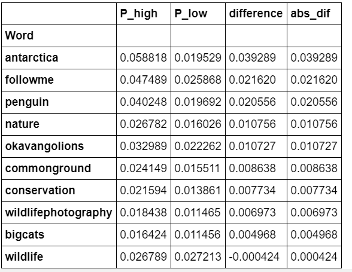

# Assignment 2

#### Abhinaya Ananthakrishnan, Akhilesh Reddy, Anisha Garg, Sherlley Loo, Teeru Gupta

## Is a Picture Worth a Thousand Words?

The good folks at National Geographic (Instagram: natgeo) have hired you as a social media analytics consultant to help them increase engagement on their Instagram page. Natgeo expects you to advise them on what type of content they should post more and less of – i.e., what types of images increase engagement? What types decrease engagement?

You will have to scrape around 500-1000 images from the natgeo Instagram page. There are some Instagram scrapers on github. However, Instagram changed its webpage design late last year, and so some of those scrapers may have to be revised. Web Scraper may also be made to work here. Along with the images, scrape captions, the number of likes and the number of comments for each post (if we had more time, I’d ask you to scrape actual comments as well for additional analysis, but ….). 

Scraper code [(here)](https://github.com/abhinaya08/social_media_analytics/blob/master/Assignment%202/Insta_scraper.ipynb)
Scraped data [(here)](https://github.com/abhinaya08/social_media_analytics/blob/master/Assignment%202/insta_caption.csv)

## Task A

Use the Google cloud vision (they are better than Azure and AWS in image analytics for sure) to obtain image tags for each post. You can create an account with Google, and the first $300 are free, which should be more than plenty for this assignment. 

You can find the labels [(here)](https://github.com/abhinaya08/social_media_analytics/blob/master/Assignment%202/gv_labels.csv)
Code to extract labels [(here)](https://github.com/abhinaya08/social_media_analytics/blob/master/Assignment%202/SMA%20-%20Google%20Vision%20Labels.ipynb)

## Task B

Create a metric (score) for engagement by using a weighted sum of number of likes and number of comments. Be sure to normalize number of likes and number of comments. Now create an engagement score = .4 x number of likes (normalized) + .6 x number of comments (normalized). 

Model code [(here)](https://github.com/abhinaya08/social_media_analytics/blob/master/Assignment%202/Assignment%202%20-%20Part%20B-V2.ipynb)

### Build a model to predict engagement with image labels (text) as predictors. Is this model better than using captions to predict the same? What if you used both image labels and captions to predict engagement? 

|                                 	| Random Forest 	| XG Boost 	|
|---------------------------------	|---------------	|----------	|
| Model using only image labels   	| 1.07          	| 1.06     	|
| Model using only captions       	| 0.53          	| 0.52     	|
| Model using labels and captions 	| 1.09          	| 1.06     	|

## Task C

Perform topic modeling (LDA) on the original image labels. Choose an appropriate number of topics. You may want to start with 5 topics, but adjust the number up or down depending on the word distributions you get. Decide on a suitable name for each topic. Now sort the data from high to low engagement score, and take the highest and the lowest quartiles (by engagement score). 

Code [(here)](https://github.com/abhinaya08/social_media_analytics/blob/master/Assignment%202/C_Topic%20Modeling.ipynb)

### What are the main differences in the average topic weights of images across the two quartiles (e.g., greater weight of some topics in the highest versus lowest engagement quartiles)? Show the main results in a table. 

## Task D

### What advice would you give Natgeo to increase engagement on its Instagram page based on your findings in Tasks B and C?   

1. NatGeo should make posts with its top photographers showing natural landscapes, specifically the Artic and African landscapes with its wildlife. People especially love big cats and penguins

2. We also observe that "awareness" posts about conservation rhinos, whales and penguins leads to higher engagement

3. It's interesting how the visuals in the image drive as much engagement as the visuals + captions based on the models we built in Task B. Content marketing is a challenge for many organizations and the model we built exhibits how important content is to drive higher engagement.

