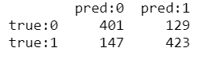
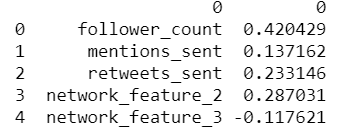
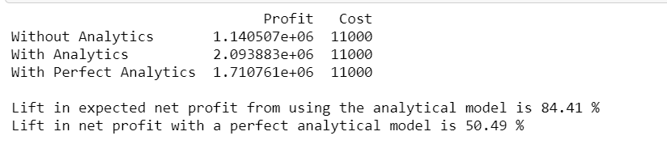
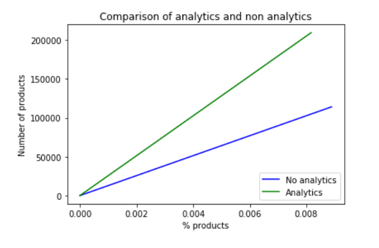

# Assignment 1

The learning objectives for this assignment are to learn ways to

1. Detect social “influencers” using network analytics
2. Quantify the financial value of influence
3. Identify and leverage influencers 

The assignment has two parts: I and II. In Part I, you will use training data on social influence to build a model predicting influencers, to find out the important predictors of influence, and to quantify the financial value of influence. In Part II, you will collect tweets, and use the predictors from Part I to identify 100 top influencers in a domain of your choice. 

## Part I: Find predictors of influence

The dataset for Part I can be http://www.kaggle.com/c/predict-who-is-more-influential-in-a-social-network
Each observation describes two individuals, A and B. There are 11 variables for each person based on Twitter activity, e.g., number of followers, retweets, network characteristics, etc. Each observation shows whether A > B (Choice = “1”) or B > A (Choice = “0”). 

Using the training data set (train.csv), create an analytic model for pairs of individuals to classify who is more influential
1. Check if you should use all variables
2. Perhaps a transformation of A/B or A-B variables will be better than using A and B variables separately. This may also be easier to interpret. 

### Report the confusion matrix of your “best” model (provide screenshot)

### From your model, which factors are best predictors of influence? (Provide screenshots). 

### Are there any surprises here? How can a business use your model/results? 
Our model can be especially useful if a business wants to identify influencers or ambassadors for its products. As we know, endorsements play a huge role today in customer conversion. Customers often spend a lot of time perusing reviews, especially leaning towards recommendations giving by gurus in that field. 

### What is the lift in expected net profit from using your analytic model (versus not using analytics)? What is the lift in net profit from using a perfect analytic model (versus not using analytics)?

